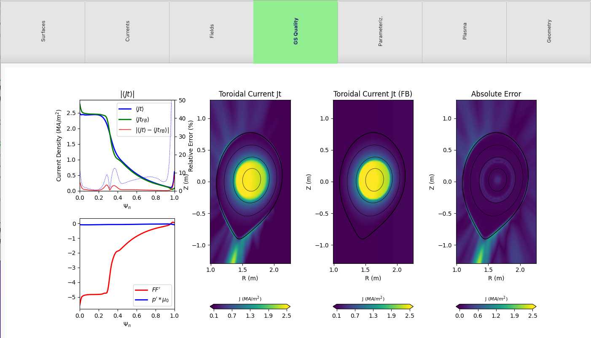
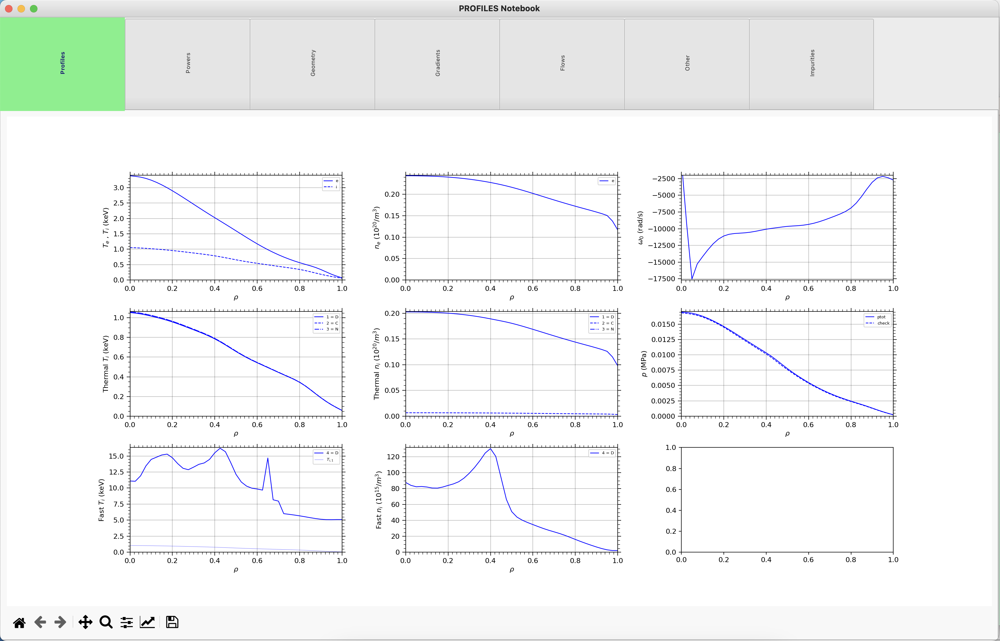

Miscellaneous
=============

**MITIM** can also be used to perform other tasks, such as:

.. contents::
	:local:
	:depth: 1

Interpret Tokamak equilibrium
-----------------------------

MITIM has a quick g-eqdsk file reader and visualizer that is based on the ``omfit-classes`` package.

To open and plot a g-eqdsk file:

.. code-block:: python

	from mitim_tools.gs_tools import GEQtools
	g = GEQtools.MITIMgeqdsk(file)
	g.plot()

It will plot results in a notebook-like plot with different tabs:

.. raw:: html

     

Note that the same can be achieved with the following alias:
    
    .. code-block:: bash
        
        mitim_plot_eq eq_file.geqdsk

Interpret input.gacode files
----------------------------

MITIM has a quick ``input.gacode`` file reader and visualizer.

To open and plot an ``input.gacode`` file:

.. code-block:: python

	from mitim_tools.gacode_tools import PROFILEStools
	p = PROFILEStools.PROFILES_GACODE(file)
	p.plot()

It will plot results in a notebook-like plot with different tabs:

.. raw:: html

     

Note that the same can be achieved with the following alias:
    
    .. code-block:: bash
        
        mitim_plot_gacode input.gacode