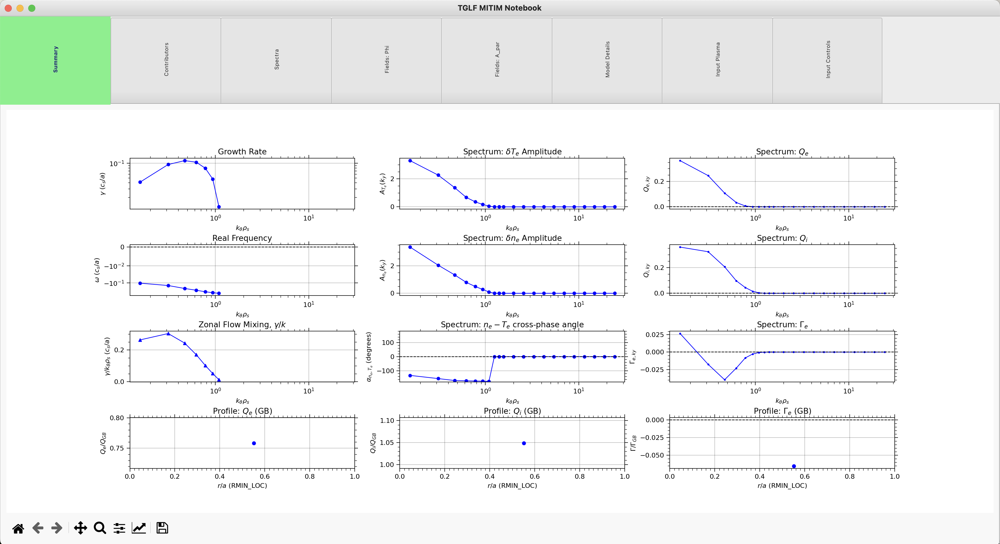
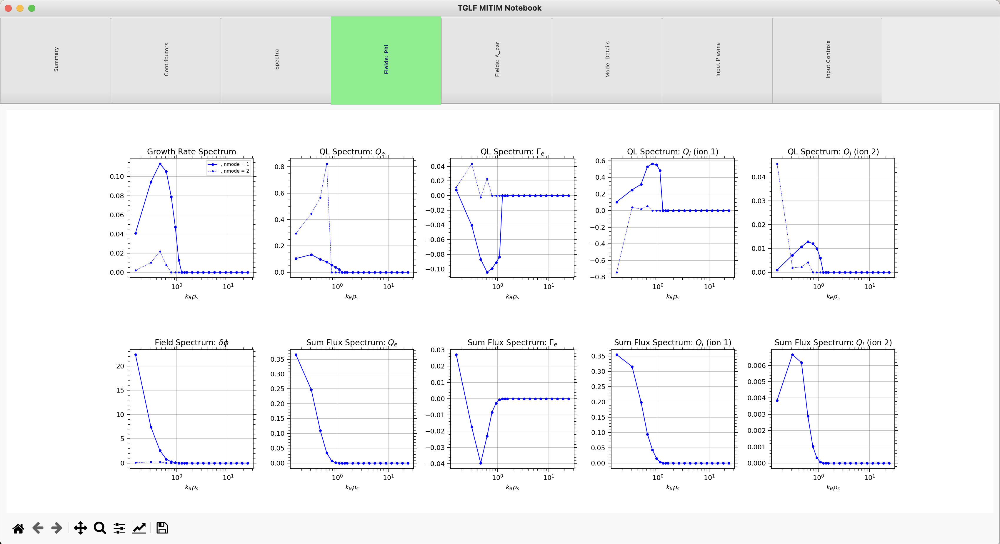

TGLF
====

**MITIM** can be used to run the TGLF model, interpret results, plot revelant quantities and perform scans and transport analyses.
This framework does not provide linceses or support to run TGLF, therefore, please see :ref:`Installation` for information on how to get TGLF working and how to configure your setup.

Once setup has been successful, the following regression test should run smoothly:

.. code-block:: console

    python3 MITIM-fusion/tests/TGLF_workflow.py

.. contents:: Contents
    :local:
    :depth: 1

Plot TGLF results
-----------------

MITIM provides comprehensive utilities to interpret the results of TGLF simulations.
As will be detailed in :ref:`TGLF aliases`, we can use the ``mitim_plot_tglf`` alias to plot TGLF results that exist in folder ``tglf_run/``:

.. code-block:: bash
    
    mitim_plot_tglf tglf_run/

Running this will open an interactive python session and show a comprehensive notebook with all the relevant TGLF outputs:

.. raw:: html

     

The results can be accessed from the ``tglf.results`` dictionary.

Run TGLF from input.gacode
--------------------------

For this tutorial we will need the following modules:

.. code-block:: python

    from pathlib import Path
    from mitim_tools.gacode_tools import TGLFtools

Select the location of the input.gacode file to start the simulation from. You should also select the folder where the simulation will be run:

.. code-block:: python

    inputgacode_file = Path('MITIM-fusion/tests/data/input.gacode')
    folder           = Path('MITIM-fusion/tests/scratch/tglf_tut')

The TGLF class can be initialized by providing the radial location (in square root of normalized toroidal flux, ``rho``) to run. Note that the values are given as a list, and several radial locations can be run at once:

.. code-block:: python

    tglf = TGLFtools.TGLF(rhos=[0.5, 0.7])

To generate the input files (input.tglf) to TGLF at each radial location, MITIM needs to run a few commands to correctly map the quantities in the input.gacode file to the ones required by TGLF. This is done automatically with the ``prep()`` command. Note that MITIM has a *only-run-if-needed* philosophy and if it finds that the input files to TGLF already exist in the working folder, the preparation method will not run any command, unless a ``cold_start = True`` argument is provided.

.. code-block:: python

    _ = tglf.prep(inputgacode_file,folder,cold_start=False)

Now, we are ready to run TGLF. Once the ``prep()`` command has finished, one can run TGLF with different settings and assumptions.
That is why, at this point, a sub-folder name for this specific run can be provided. Similarly to the ``prep()`` command, a ``cold_start`` flag can be provided.

The set of control inputs to TGLF (saturation rule, electromagnetic effects, basis functions, etc.) are provided following the following sequential logic:

1. Each code has a set of default settings, which for TGLF are specified in ``templates/input.tglf.controls``. This is the base namelist of settings that will be used if no other specification is provided.
2. Then, a ``code_settings`` argument can be provided to the ``run()`` command. This argument refers to a specific set of settings that are specified in ``templates/input.tglf.models.yaml``, and that will overwrite the default settings in ``input.tglf.controls``.
3. Finally, an ``extraOptions`` argument can be provided to the ``run()`` command, which is a dictionary of specific settings to change from the previous two steps.

For example, the following two commands will run TGLF with saturation rule number 2 with and without electromagnetic effets. After each ``run()`` command, a ``read()`` is needed, to populate the *tglf.results* dictionary with the TGLF outputs (``label`` refers to the dictionary key for each run):

.. code-block:: python

    tglf.run( subfolder = 'yes_em_folder', 
              code_settings  = 'SAT2',
              extraOptions  = {'USE_BPER':True},
              cold_start       = False )

    tglf.read( label = 'yes_em' )

    tglf.run( subfolder = 'no_em_folder', 
              code_settings  = 'SAT2',
              extraOptions  = {'USE_BPER':False},
              cold_start       = False )

    tglf.read( label = 'no_em' )

.. tip::

    In this example, ``tglf.results['yes_em']`` and ``tglf.results['no_em']`` are themselves dictionaries, so please do ``.keys()`` to get all the possible results that have been obtained.

TGLF results can be plotted together by indicating what labels to plot:
    
.. code-block:: python

    tglf.plot( labels = ['yes_em', 'no_em'] )

As a result, a TGLF notebook with different tabs will be opened with all relevant output quantities:

.. image:: ./figs/TGLFnotebook.png
   :align: center
   :alt: TGLF_Notebook

.. raw:: html

     

Run TGLF from TRANSP results file
---------------------------------

If instead of an input.gacode, you have a TRANSP .CDF file (``cdf_file``) and want to run TGLF at a specific time (``time``) with an +- averaging time window (``avTime``), you must initialize the TGLF class as follows:

.. code-block:: python

    from pathlib import Path
    from mitim_tools.gacode_tools import TGLFtools

    cdf_file = Path('MITIM-fusion/tests/data/12345.CDF')
    folder   = Path('MITIM-fusion/tests/scratch/tglf_tut')

    tglf     = TGLFtools.TGLF(  cdf    = cdf_file,
                                rhos   = [0.5,0.7],
                                time   = 2.5,
                                avTime = 0.02 )

Similarly as in the previous section, you need to run the ``prep()`` command, but this time you do not need to provide the input.gacode file:

.. code-block:: python

    cdf = tglf.prep_using_tgyro(folder,cold_start=False)

.. note::

    The ``.prep()`` method, when applied to a case that starts from a TRANSP .CDF file, now performs two extra operations:

    - **TRXPL** (https://w3.pppl.gov/~hammett/work/GS2/docs/trxpl.txt) to generate *plasmastate.cdf* and *.geq* files for a specific time-slice from the TRANSP outputs.

    - **PROFILES_GEN** to generate an *input.gacode* file from the *plasmastate.cdf* and *.geq* files. This file is standard within the GACODE suite and contains all plasma information that is required to run core transport codes.

The rest of the workflow is identical to the previous section, including ``.run()``, ``.read()`` and ``.plot()``.

Run TGLF from input.tglf file
-----------------------------

If you have a input.tglf file already, you can still use this script to run it.

.. code-block:: python

    from pathlib import Path
    from mitim_tools.gacode_tools import TGLFtools

    inputgacode_file = Path('MITIM-fusion/tests/data/input.gacode')
    folder           = Path('MITIM-fusion/tests/scratch/tglf_tut')
    inputtglf_file   = Path('MITIM-fusion/tests/data/input.tglf')

    tglf = TGLFtools.TGLF()
    tglf.prep_from_file( folder, inputtglf_file, input_gacode = inputgacode_file )

The rest of the workflow is identical, including ``.run()``, ``.read()`` and ``.plot()``.

.. tip::

    The provision of an input.gacode file as in the example above is not necessary.
    However, if no input.gacode file is provided, MITIM will not be able to unnormalize the TGLF results.

.. tip::

    Once the TGLF class has been prepared, if the results exist already in the folder, ``.run()`` is not needed and results can be read and plotted:

    .. code-block:: python

        from pathlib import Path
        from mitim_tools.gacode_tools import TGLFtools

        folder           = Path('MITIM-fusion/tests/scratch/tglf_tut/yes_em_folder')
        inputtglf_file   = Path('MITIM-fusion/tests/data/input.tglf')

        tglf = TGLFtools.TGLF()
        tglf.prep_from_file( folder, inputtglf_file )
        tglf.read (folder = f'{folder}/', label = 'yes_em' )
        tglf.plot( labels = ['yes_em'] )

    Please note that the previous code will only work is TGLF was run using MITIM. This is because MITIM stores the results
    with a suffix that indicates the radial location (``rho``) where the run was performed.

    If you want to read results from a TGLF run that was not performed with MITIM, you can provide the ``suffix`` specification
    to the ``.read()`` method, including ``None``:

    .. code-block:: python

        tglf.read (folder = f'{folder}/', suffix = None, label = 'yes_em' )

Run 1D scans of TGLF input parameter
------------------------------------

*Under Development*

*(In the meantime, please checkout* `tutorials/TGLF_tutorial.py <https://github.com/pabloprf/MITIM-fusion/blob/main/tutorials/PORTALS_tutorial.py>`_ *)*

TGLF aliases
------------

MITIM provides a few useful aliases, including for the TGLF tools: :ref:`Shell Scripts`
