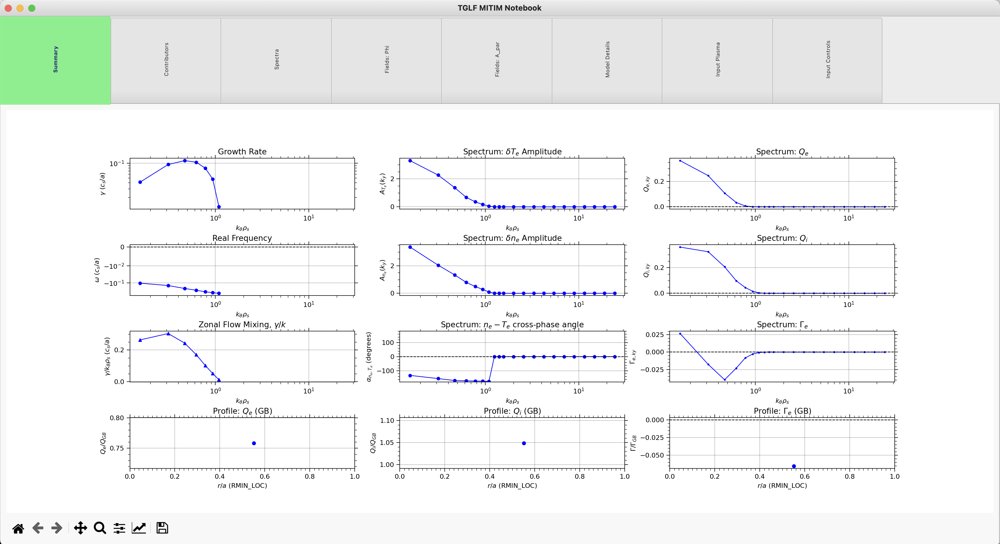
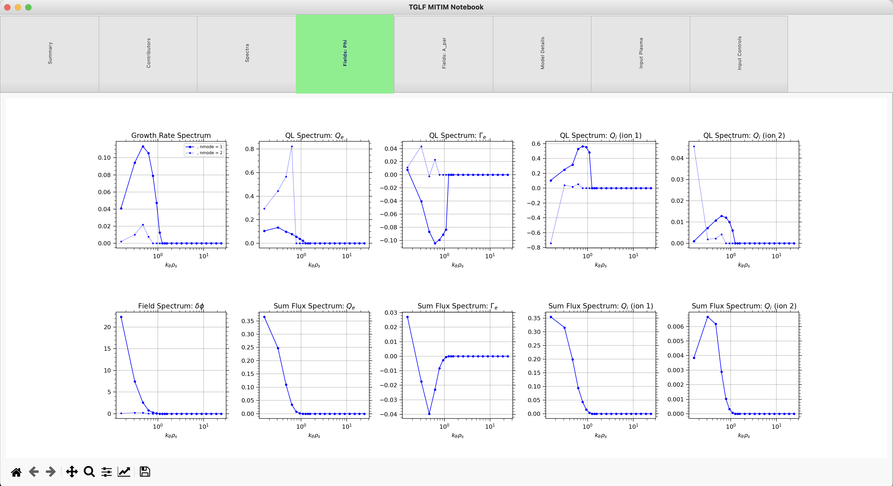

TGLF
====

**MITIM** can be used to run the TGLF model, interpret results, plot revelant quantities and perform scans and transport analyses.
This framework does not provide linceses or support to run TGLF, therefore, please see :ref:`Installation` for information on how to get TGLF working and how to configure your setup.

Once setup has been successful, the following regression test should run smoothly:

.. code-block:: console

    python3 $MITIM_PATH/tests/TGLF_workflow.py

.. contents:: Contents
    :local:
    :depth: 1

Plot TGLF results
-----------------

MITIM provides comprehensive utilities to interpret the results of TGLF simulations.
As will be detailed in :ref:`TGLF aliases`, we can use the ``mitim_plot_tglf`` alias to plot TGLF results that exist in folder ``tglf_run/``:

.. code-block:: bash
    
    mitim_plot_tglf tglf_run/

Running this will open an interactive python session and show a comprehensive notebook with all the relevant TGLF outputs:

.. raw:: html

     

The results can be accessed from the ``tglf.results`` dictionary.

Run TGLF from input.gacode
--------------------------

.. toctree::
   :maxdepth: 2

   notebooks/tglf.ipynb

Run TGLF from TRANSP results file
---------------------------------

If instead of an input.gacode, you have a TRANSP .CDF file (``cdf_file``) and want to run TGLF at a specific time (``time``) with an +- averaging time window (``avTime``), you must initialize the TGLF class as follows:

.. code-block:: python

    from mitim_tools.gacode_tools import TGLFtools
    from mitim_tools.misc_tools   import IOtools

    cdf_file = IOtools.expandPath('$MITIM_PATH/tests/data/12345.CDF')		
    folder   = IOtools.expandPath('$MITIM_PATH/tests/scratch/tglf_tut/')

    tglf     = TGLFtools.TGLF( cdf    = cdf_file,
                                hos   = [0.5,0.7],
                                ime   = 2.5,
                                vTime = 0.02 )

Similarly as in the previous section, you need to run the ``prep()`` command, but this time you do not need to provide the input.gacode file:

.. code-block:: python

    cdf = tglf.prep(folder,restart=False)

.. note::

    The ``.prep()`` method, when applied to a case that starts from a TRANSP .CDF file, now performs two extra operations:

    - **TRXPL** (https://w3.pppl.gov/~hammett/work/GS2/docs/trxpl.txt) to generate *plasmastate.cdf* and *.geq* files for a specific time-slice from the TRANSP outputs.

    - **PROFILES_GEN** to generate an *input.gacode* file from the *plasmastate.cdf* and *.geq* files. This file is standard within the GACODE suite and contains all plasma information that is required to run core transport codes.

The rest of the workflow is identical to the previous section, including ``.run()``, ``.read()`` and ``.plot()``.

Run TGLF from input.tglf file
-----------------------------

If you have a input.tglf file already, you can still use this script to run it.

.. code-block:: python

    from mitim_tools.gacode_tools import TGLFtools
    from mitim_tools.misc_tools   import IOtools

    inputgacode_file = IOtools.expandPath('$MITIM_PATH/tests/data/input.gacode')
    folder           = IOtools.expandPath('$MITIM_PATH/tests/scratch/tglf_tut/')
    inputtglf_file   = IOtools.expandPath('$MITIM_PATH/tests/data/input.tglf')

    tglf = TGLFtools.TGLF()
    tglf.prep_from_tglf( folder, inputtglf_file, input_gacode = inputgacode_file )

The rest of the workflow is identical, including ``.run()``, ``.read()`` and ``.plot()``.

.. tip::

    The provision of an input.gacode file as in the example above is not necessary.
    However, if no input.gacode file is provided, MITIM will not be able to unnormalize the TGLF results.

.. tip::

    Once the TGLF class has been prepared, if the results exist already in the folder, ``.run()`` is not needed and results can be read and plotted:

    .. code-block:: python

        from mitim_tools.gacode_tools import TGLFtools
        from mitim_tools.misc_tools   import IOtools

        folder           = IOtools.expandPath('$MITIM_PATH/tests/scratch/tglf_tut/yes_em_folder/')
        inputtglf_file   = IOtools.expandPath('$MITIM_PATH/tests/data/input.tglf')

        tglf = TGLFtools.TGLF()
        tglf.prep_from_tglf( folder, inputtglf_file )
        tglf.read (folder = f'{folder}/', label = 'yes_em' )
        tglf.plot( labels = ['yes_em'] )

    Please note that the previous code will only work is TGLF was run using MITIM. This is because MITIM stores the results
    with a suffix that indicates the radial location (``rho``) where the run was performed.

    If you want to read results from a TGLF run that was not performed with MITIM, you can provide the ``suffix`` specification
    to the ``.read()`` method, including ``None``:

    .. code-block:: python

        tglf.read (folder = f'{folder}/', suffix = None, label = 'yes_em' )

Run 1D scans of TGLF input parameter
------------------------------------

*Under Development*

*(In the meantime, please checkout* `tutorials/TGLF_tutorial.py <https://github.com/pabloprf/MITIM-fusion/blob/main/tutorials/PORTALS_tutorial.py>`_ *)*

TGLF aliases
------------

MITIM provides a few useful aliases, including for the TGLF tools:

- To plot results that exist in a folder ``run1/``, with or without a suffix and with or without an input.gacode file (for normalizations):
    
    .. code-block:: bash
        
        mitim_plot_tglf run1/
        mitim_plot_tglf run1/ --suffix _0.55 --gacode input.gacode

- To run TGLF in a folder ``run1/`` using input file ``input.tglf``, with or without an input.gacode file (for normalizations):
    
    .. code-block:: bash
        
        mitim_run_tglf --folder run1/ --tglf input.tglf
        mitim_run_tglf --folder run1/ --tglf input.tglf --gacode input.gacode

- To run a parameter scan in a folder ``scan1/`` using input file ``input.tglf``, with or without an input.gacode file (for normalizations):
    
    .. code-block:: bash
        
        mitim_run_tglf --folder scan1/ --tglf input.tglf --gacode input.gacode --scan RLTS_2

