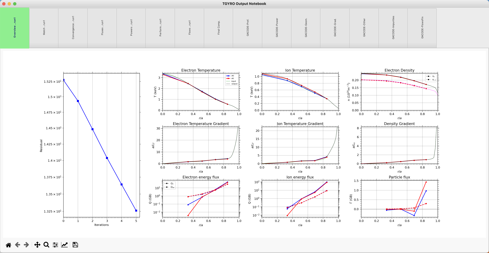

TGYRO
=====

**MITIM** can be used to run the TGYRO transport solver, interpret results and plot revelant quantities.
This framework does not provide linceses or support to run TGYRO, therefore, please see :ref:`Installation` for information on how to get TGYRO working and how to configure your setup.

Once setup has been successful, the following regression test should run smoothly:

.. code-block:: console

	python3 $MITIM_PATH/tests/TGYRO_workflow.py

.. contents:: Contents
    :local:
    :depth: 1

Run TGYRO from an input.gacode file
-----------------------------------

For this tutorial we will need the following modules:

.. code-block:: python

	from mitim_tools.gacode_tools import TGYROtools,PROFILEStools
	from mitim_tools.misc_tools   import IOtools

Select the location of the input.gacode file to start the simulation from. Note that you can use the ``IOtools.expandPath()`` method to work with relative paths. You should also select the folder where the simulation will be run:

.. code-block:: python

	gacode_file = IOtools.expandPath('$MITIM_PATH/tests/data/input.gacode' )
	folder      = IOtools.expandPath('$MITIM_PATH/tests/scratch/tgyro_tut/')

Create a PROFILES class from the input.gacode file:

.. code-block:: python

	profiles = PROFILEStools.PROFILES_GACODE(gacode_file)

.. tip::

	Note that the profiles class can be plotted, for convenience.

	.. code-block:: python

		profiles.plot()

	.. figure:: ./figs/PROFILESnotebook.png
		:align: center
		:alt: PROFILES_Notebook
		:figclass: align-center

Now the TGYRO class can be created:

.. code-block:: python

	tgyro = TGYROtools.TGYRO()
	tgyro.prep(folder,profilesclass_custom=profiles)

Now it is time to set the TGYRO settings, such as the radial range (``vectorRange[0]`` to ``vectorRange[1]``), number of points to simulate (vectorRange[2]), the solver parameters, physics and TGLF options:

.. code-block:: python

    rhos            = [0.3,0.5,0.7,0.9]
    solver          = { 'step_jac':    1E-2,
                        'step_max':    1E-2,
                        'res_method':     2,
                        'tgyro_method':   6,
                        'relax_param':   0.1 } 

    physics_options = { 'TargetType':2 }   # 2: Only evolve exchange, 3: Reactor
    PredictionSet   = [1,1,0]              # Profiles to predict: [Te, Ti, ne]
    iterations      = 5                    # Number of TGYRO iterations
    TGLFsettings    = 5                    # TGLF pre-sets

Now TGYRO can be run:

.. code-block:: python

    tgyro.run( subFolderTGYRO        = 'run1/',      
               iterations            = iterations,
               special_radii         = rhos,
               PredictionSet         = PredictionSet,
               TGLFsettings          = TGLFsettings,
               TGYRO_solver_options  = solver,
               TGYRO_physics_options = physics_options)

Read:

.. code-block:: python

	tgyro.read(label='run1')

And plot:

.. code-block:: python

	tgyro.plotRun(labels=['run1'])

As a result, a TGYRO notebook with different tabs will be opened with all relevant output quantities:

.. raw:: html

     

Read TGYRO results that were run externally
----------------------------------------------

Create a profiles class with the `input.gacode` file that TGYRO used to run and the folder with all output files:

.. code-block:: python

	from mitim_tools.gacode_tools import TGYROtools,PROFILEStools
	from mitim_tools.misc_tools   import IOtools

	gacode_file = IOtools.expandPath('$MITIM_PATH/tests/data/input.gacode')
	folder      = IOtools.expandPath('$MITIM_PATH/tests/scratch/tgyro_tut/run1/')

	profiles    = PROFILEStools.PROFILES_GACODE(gacode_file)
	tgyro_out   = TGYROtools.TGYROoutput(folder,profiles=profiles)

Plot results:

.. code-block:: python

	tgyro_out.plot()

TGYRO aliases
-------------

MITIM provides a few useful aliases, including for the TGYRO tools:

- To plot results that exist in a folder ``run1/``:
    
    .. code-block:: bash
        
        mitim_plot_tgyro run1/

