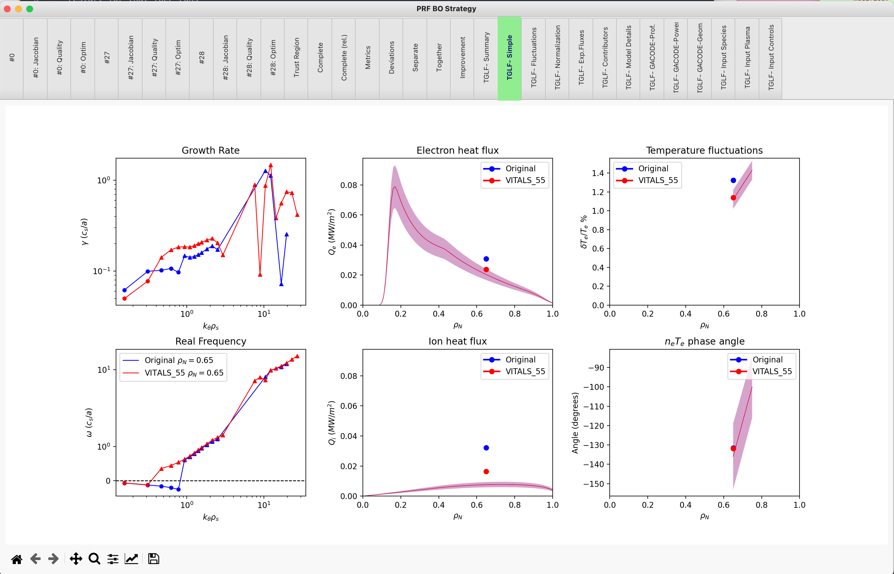

VITALS
======

The VITALS (Validation via Iterative Training of Active Learning Surrogates) method, described in `P. Rodriguez-Fernandez et al., Fusion Technol. 74:1-2, 65-76 (2018) <https://www.tandfonline.com/doi/full/10.1080/15361055.2017.1396166>`_ consists of using surrogate-based optimization techniques to help in the multi-channel validation of transport models.

VITALS has been implemented to work with the TGLF model, and can be run using the MITIM repo, following a few steps described below.

Once setup has been successful, the following regression test should run smoothly:

.. code-block:: console

   python3 $MITIM_PATH/tests/VITALS_workflow.py

.. contents:: Contents
    :local:
    :depth: 2

1. Preparation of TGLF class
----------------------------

For this tutorial we will need the following modules and the folder to run VITALS:

.. code-block:: python

	import numpy as np

	from mitim_tools.gacode_tools import TGLFtools
	from mitim_tools.misc_tools   import IOtools
	from mitim_modules.vitals     import VITALSmain
	from mitim_tools.opt_tools    import STRATEGYtools

	folder = IOtools.expandPath( '$MITIM_PATH/tests/scratch/vitals_tut/' )

As a starting point of VITALS, you need to prepare and run TGLF for the base case (please follow the :ref:`TGLF` tutorial for more details):

.. code-block:: python

	inputgacode_file = IOtools.expandPath( '$MITIM_PATH/tests/data/input.gacode' )
	rho              = 0.5
	
	tglf = TGLFtools.TGLF( rhos = [ rho ] )
	cdf = tglf.prep( folder, inputgacode = inputgacode_file)
	tglf.run( subFolderTGLF = 'run_base/', TGLFsettings = 5)
	tglf.read( label = 'run_base' )

.. note::

	If you want to match fluctuation levels or nT cross-phase angles in VITALS, information about the synthetic diagnostic must be provided in the ``read()`` stage for each radial location:

	.. code-block:: python

	    tglf.read( label = 'run_base', d_perp_cm = { rho: 1.9 } )

	Currently, the synhetic diagnostic to produce fluctuation levels out of amplitude spectra is handled by the ``convolution_CECE`` function in ``mitim/gacode_tools/GACODEdefaults.py``. To understand the meaning of the ``d_perp_cm`` keyword argument provided above, please check out the code.

Now, once TGLF has run and outputs have been read and stored in the ``tglf.results`` dictionary, information about the experiment needs to be provided. Note that the errors (standard deviation) are provided in absolute units (MW/m^2), but the Qe and Qi errors in the example above are written such as they are 20% from the base case. This is because the TGLF object already includes those experimental fluxes because they existed in the *input.gacode* file. However, this way of specifying the error is completely up to the user.

.. code-block:: python

	tglf.NormalizationSets['EXP']['exp_Qe_rho']     = [rho]
	Qe_base = tglf.NormalizationSets['EXP']['exp_Qe'][np.argmin(np.abs(tglf.NormalizationSets['EXP']['rho']-rho))]
	tglf.NormalizationSets['EXP']['exp_Qe_error']   = [ Qe_base * 0.2 ] # e.g. 20% error

	tglf.NormalizationSets['EXP']['exp_Qi_rho']     = [rho]
	Qi_base = tglf.NormalizationSets['EXP']['exp_Qi'][np.argmin(np.abs(tglf.NormalizationSets['EXP']['rho']-rho))]
	tglf.NormalizationSets['EXP']['exp_Qi_error']   = [ Qi_base * 0.2 ]

.. note:: 

	If you want to match fluctuation levels or nT cross-phase angles in VITALS, information about the experimental fluctuations and the error needs to be provided as well:

	.. code-block:: python

		tglf.NormalizationSets['EXP']['exp_TeFluct_rho']    = [rho]
		tglf.NormalizationSets['EXP']['exp_TeFluct']        = [1.12] # Percent fluctuation
		tglf.NormalizationSets['EXP']['exp_TeFluct_error']  = [0.1]  # Abolute error

		tglf.NormalizationSets['EXP']['exp_neTe_rho']       = [rho]
		tglf.NormalizationSets['EXP']['exp_neTe']           = [-130] # Degrees
		tglf.NormalizationSets['EXP']['exp_neTe_error']     = [17]

At this point, the TGLF class is ready to go into VITALS. One can give the ``tglf`` object directly to VITALS, or you can save it in a pickle file to read later:

.. code-block:: python

	tglf_file = folder + 'tglf_base.pkl'
	tglf.save_pkl(tglf_file)

2. VITALS Run 
-------------

First you must select the objective functions (``ofs``) you want VITALS to match:

.. code-block:: python

	ofs = ['Qe','Qi']  # or ['Qe','Qi','TeFluct','neTe'] for fluctuation quantities

Then, the free parameters (design variables, ``dvs``) that VITALS can vary, along with their minimum and maximum variation relative to the base case:

.. code-block:: python

	dvs     = ['RLTS_1', 'RLTS_2', 'RLNS_1', 'ZEFF']
	dvs_min = [     0.7,      0.7,      0.7,    0.7]
	dvs_max	= [     1.3,      1.3,      1.3,    1.3]

Then, as it the case for all optimization problems in MITIM, you must create a function class by selecting the namelist file to use (see :ref:`Understanding the MITIM namelist` to understand how to construct the namelist file):

.. code-block:: python

	# Option 1: Provide the complete namelist yourself
	vitals_fun = VITALSmain.evaluateVITALS( folder, namelist = path_to_namelist )

	# Option 2: Use a curated VITALS namelist and only modify some requested values
	vitals_fun = VITALSmain.evaluateVITALS( folder )
	vitals_fun.Optim['BOiterations'] = 5

Once the VITALS object has been created, parameters such as the TGLF control inputs can be chosen:

.. code-block:: python

	vitals_fun.TGLFparameters['TGLFsettings']  = 5
	vitals_fun.TGLFparameters['extraOptions']  = {}

.. note::

	At this point, the parameter ``vitals_fun.VITALSparameters['launchSlurm']`` is defaulted to ``False``. However, if the user wants to run VITALS as a slurm job in a cluster, this parameter should be set to ``True``.

We are now ready to prepare the VITALS class. Here we have two options:

.. code-block:: python

	# Option 1. Pass the tglf object directly
	vitals_fun.prep( tglf,      rho, ofs, dvs, dvs_min, dvs_max, classLoaded = True  )

	# Option 2. Pass the tglf pickled file
	vitals_fun.prep( tglf_file, rho, ofs, dvs, dvs_min, dvs_max, classLoaded = False )

Now we can create and launch the MITIM optimization process from the beginning (i.e. ``restart = True``):

.. code-block:: python

	mitim_bo = STRATEGYtools.PRF_BO(vitals_fun, restartYN = True )
	mitim_bo.run()

.. note::

	If the user wants to run VITALS as a slurm job in a cluster, it is recommended that the keyword argument ``askQuestions = False`` is passed to ``PRF_BO()``.

3. VITALS Interpretation 
------------------------

We can plot the VITALS results easily with:

.. code-block:: python

	vitals_fun.plot_optimization_results(full=True)

In the previous command, ``full=True`` means that VITALS will now run TGLF again for the base case (Evaluation #0) and the best case (best in terms of the lowest mean residual), then it will plot them together as a TGLF Notebook.
All information of the optimization process is also included in tabs in the notebook.

